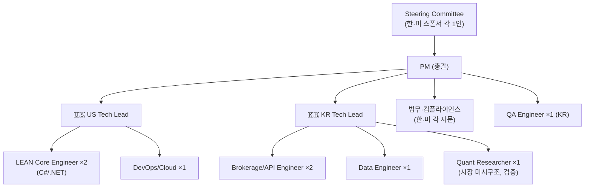
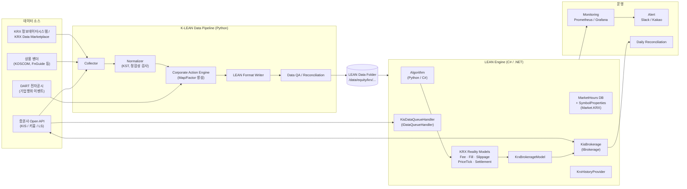
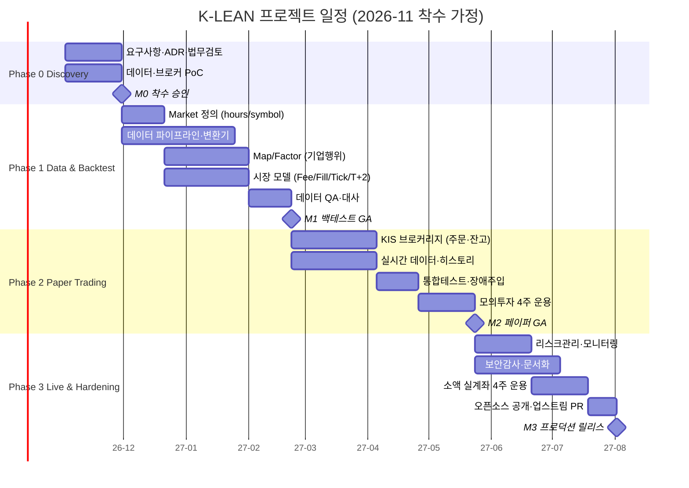

# 프로젝트 기획안: QuantConnect × KRX 연동 (Project "K-LEAN")

> **한미 공동 개발 프로젝트 — QuantConnect LEAN 엔진에서 한국거래소(KRX) 상장 종목의 데이터 수집, 백테스트, 페이퍼 트레이딩, 실거래를 지원**

| 항목 | 내용 |
|---|---|
| 문서 버전 | v0.9 (초안, 검토용) |
| 작성일 | 2026-10-04 |
| 작성자 | PM (Claude) |
| 상태 | Draft: 스폰서 승인 대기 |
| 대상 독자 | 프로젝트 스폰서, 한·미 개발 리드, 법무·컴플라이언스, 퀀트 리서치 팀 |
| 코드네임 | **K-LEAN** (Korea + LEAN) |

> ⚠️ 표기 규칙: **[확인 필요]**가 붙은 항목은 규정·요율·API 사양처럼 자주 바뀌는 사실이므로, 착수 전에 공식 출처(KRX, 금융위원회/금감원, 증권사 API 문서, QuantConnect 문서)에서 다시 확인해야 합니다.

---

## 목차

1. [요약 (Executive Summary)](#1-요약-executive-summary)
2. [배경 및 문제 정의](#2-배경-및-문제-정의)
3. [목표, 비목표, 성공 지표](#3-목표-비목표-성공-지표)
4. [범위 및 단계별 산출물](#4-범위-및-단계별-산출물)
5. [조직 구성 및 한미 협업 모델](#5-조직-구성-및-한미-협업-모델)
6. [한국 시장 특성과 요구사항](#6-한국-시장-특성과-요구사항)
7. [시스템 아키텍처](#7-시스템-아키텍처)
8. [컴포넌트 상세 설계](#8-컴포넌트-상세-설계)
9. [데이터 소싱 전략](#9-데이터-소싱-전략)
10. [브로커리지(주문 집행) 연동 전략](#10-브로커리지주문-집행-연동-전략)
11. [법무, 규제, 컴플라이언스](#11-법무-규제-컴플라이언스)
12. [일정 및 마일스톤](#12-일정-및-마일스톤)
13. [예산 및 리소스](#13-예산-및-리소스)
14. [리스크 관리](#14-리스크-관리)
15. [품질 보증 및 테스트 전략](#15-품질-보증-및-테스트-전략)
16. [오픈소스 및 거버넌스 전략](#16-오픈소스-및-거버넌스-전략)
17. [의사결정 필요 사항](#17-의사결정-필요-사항)
18. [부록](#18-부록)

---

## 1. 요약 (Executive Summary)

**무엇을:** QuantConnect의 오픈소스 알고리즘 트레이딩 엔진 **LEAN**에 한국 주식시장(KOSPI, KOSDAQ, 선택적으로 KONEX와 Nextrade(NXT) 대체거래소)을 정식 "Market"으로 추가합니다. 추가 대상은 다음 네 가지입니다.

1. **데이터 계층**: KRX 일봉, 분봉, 틱 데이터를 LEAN 포맷으로 변환하고, 기업행위(액면분할, 무상증자, 배당, 종목코드 변경) 보정 파일을 만듭니다.
2. **시장 모델 계층**: 거래시간, 휴장일, 호가단위, 가격제한폭(±30%), 거래세와 수수료, T+2 결제, 단일가매매를 반영합니다.
3. **브로커리지 계층**: 한국 증권사 Open API(1차 후보: 한국투자증권 KIS Developers)를 LEAN `IBrokerage`와 `IDataQueueHandler`로 구현합니다.
4. **운영 계층**: LEAN CLI 기반 로컬과 클라우드 배포, 모니터링, 리컨실리에이션(잔고 대사)을 갖춥니다.

**왜:** 현재 QuantConnect는 미국 주식, 옵션, 선물, FX, 크립토는 잘 지원하지만 한국 주식은 기본 지원하지 않습니다. 한국 퀀트는 백테스트(Python, pandas)와 실거래(증권사 API)를 따로 만들어 쓰고 있어서, 연구와 운용 사이에 괴리가 생기고 검증된 엔진의 이점을 누리지 못합니다. 미국 측은 아시아 시장 확장 수요가 있고, 한국 측은 글로벌 표준 툴체인이 필요합니다.

**어떻게:** 미국 팀이 LEAN 코어와 엔진 확장 포인트, 클라우드 인프라를 맡고, 한국 팀이 시장 미시구조, 증권사 API, 규제, 데이터 라이선스를 맡는 **기능 분업형** 구조로 진행합니다. 기간은 약 **9개월(3단계)**입니다.

**핵심 결정 요청(17장 상세):**
① 1차 브로커 선정, ② 데이터 소스 라이선스 범위, ③ 오픈소스 공개 범위, ④ 법인 및 계약 구조(한미 IP 귀속).

---

## 2. 배경 및 문제 정의

### 2.1 현황

| 구분 | 현재 상태 | 문제점 |
|---|---|---|
| 백테스트 | pykrx, FinanceDataReader 등으로 수집한 데이터에 자체 스크립트, backtrader나 zipline 포크 사용 | 생존편향, 기업행위 보정 누락, 체결 가정의 비현실성 |
| 실거래 | 증권사별 API(키움 OpenAPI+는 Windows/COM/32bit 제약)로 별도 코드 작성 | 백테스트 코드와 실거래 코드가 이원화됨 |
| QuantConnect | 미국 중심. 커스텀 데이터(`PythonData`)로 KRX 데이터를 넣을 수는 있으나 비공식 방식 | 호가단위, 세금, 거래시간, 결제주기, 실거래 연동이 없음 |

### 2.2 기회

- **LEAN은 Apache 2.0 오픈소스**이고 `IBrokerage`, `IDataQueueHandler`, `IHistoryProvider`, `IFeeModel` 같은 플러그인 인터페이스가 잘 정의되어 있습니다. 이미 커뮤니티 브로커리지 플러그인 생태계도 있습니다.
- 한국 증권사의 **REST/WebSocket 기반 Open API**가 보편화되면서(KIS Developers, 키움 REST API, LS증권 Open API 등) 크로스플랫폼(Linux, Docker) 연동이 가능해졌습니다.
- 2025년 공매도 전면 재개와 대체거래소(Nextrade) 출범 등으로 한국 시장 구조가 바뀌면서 정교한 시뮬레이터에 대한 수요가 늘었습니다.
- 외국인 투자자 등록제 폐지 같은 자본시장 선진화 조치로 해외 투자자의 접근성이 좋아지는 추세입니다. **[확인 필요: 최신 제도 현황]**

### 2.3 문제 정의 (Problem Statement)

> "한국 주식을 대상으로 하는 퀀트 전략을 **하나의 코드베이스**로 연구, 백테스트, 페이퍼, 실거래까지 일관되게 운용할 수 있는 **검증된 오픈 인프라가 없다**."

---

## 3. 목표, 비목표, 성공 지표

### 3.1 목표 (Goals)

| ID | 목표 | 설명 |
|---|---|---|
| G1 | KRX Market 정식 지원 | LEAN에 `Market.KRX`(가칭)를 추가하고 market-hours와 symbol-properties DB를 등록 |
| G2 | 고품질 히스토리 데이터 | 2000년 이후 KOSPI/KOSDAQ 전 종목 일봉, 최근 N년 분봉, 상장폐지 종목 포함(생존편향 제거) |
| G3 | 현실적 체결 시뮬레이션 | 호가단위, 상하한가, 단일가매매, 거래세, 수수료, 슬리피지 모델 |
| G4 | 실거래 연동 | 최소 1개 국내 증권사 API로 주문, 체결, 잔고, 실시간 시세 |
| G5 | 동일 코드 운용 | 같은 알고리즘 코드를 백테스트, 페이퍼, 라이브에서 수정 없이 실행 |
| G6 | 한미 협업 프로세스 정착 | 시차를 고려한 비동기 개발 프로세스와 이중언어 문서화 |

### 3.2 비목표 (Non-Goals) — 이번 범위에서 제외

- 파생상품(KOSPI200 선물·옵션, ELW) 실거래 (Phase 4 후보로 검토)
- 초단타(HFT) 및 코로케이션 수준의 지연시간 최적화
- 타인 자금 운용 서비스(투자일임, 자문). 이는 별도 인허가 사안입니다.
- QuantConnect 클라우드(quantconnect.com)에 KRX 데이터를 상업 배포하는 것. 이는 QC 본사와의 별도 파트너십 사안입니다.
- 채권, ETN, 해외 상장 한국 ADR

### 3.3 성공 지표 (KPI)

| KPI | 목표치 | 측정 방법 |
|---|---|---|
| 데이터 정확도 | 일봉 종가 일치율 ≥ 99.99% (KRX 공식 대비) | 샘플 1,000종목 × 전 기간 자동 대사 |
| 기업행위 보정 정확도 | 수정주가 오차 < 0.01% | 상위 200종목 수정주가를 외부 벤더와 교차검증 |
| 백테스트 vs 실거래 괴리 | 페이퍼 4주 운용 시 일별 P&L 괴리 < 10bp | 동일 전략 병행 운용 |
| 주문 처리 안정성 | 라이브 주문 성공률 ≥ 99.9%, 재연결 후 상태 복구 100% | 장애 주입 테스트 |
| 지연시간 | 시그널 발생부터 주문 접수까지 p95 < 300ms (REST 기준) | 로그 타임스탬프 |
| 테스트 커버리지 | 신규 코드 ≥ 80% | CI 리포트 |
| 커뮤니티 | (공개 시) GitHub Star 500+, 외부 기여자 10명+ (출시 6개월 내) | GitHub |

---

## 4. 범위 및 단계별 산출물

### 4.1 단계 구성

| 단계 | 기간 | 핵심 산출물 | 종료 기준 (Exit Criteria) |
|---|---|---|---|
| **Phase 0: Discovery** | M0 (4주) | 요구사항 정의서, 데이터/브로커 PoC, 법무 검토 의견서, 아키텍처 결정문서(ADR) | 스폰서가 1차 브로커와 데이터 소스 승인 |
| **Phase 1: Data & Backtest** | M1–M3 | `Market.KRX`, 데이터 변환기, Map/Factor 파일, 수수료·세금·호가 모델, 샘플 알고리즘 | 일봉·분봉 백테스트가 KPI 정확도 충족 |
| **Phase 2: Live (Paper)** | M4–M6 | KIS 브로커리지 플러그인(모의투자), 실시간 데이터 핸들러, 히스토리 프로바이더 | 모의투자 4주 무중단 운용, 괴리 KPI 충족 |
| **Phase 3: Live (Real) & Hardening** | M7–M9 | 실계좌 운용, 모니터링·알림, 2차 브로커(선택), 문서화와 오픈소스 공개 | 소액 실계좌 4주 운용, 보안 감사 통과 |
| *Phase 4 (옵션)* | 이후 | 지수 선물·옵션, NXT 통합 라우팅, QC 클라우드 파트너십 | 별도 승인 |

### 4.2 작업 분해 구조 (WBS, 요약)

```
K-LEAN
├── 1. 프로젝트 관리
│   ├── 1.1 거버넌스·보고 체계
│   ├── 1.2 계약·IP·NDA (한미)
│   └── 1.3 리스크·이슈 관리
├── 2. 시장 정의 (Market Definition)
│   ├── 2.1 market-hours-database (KRX/NXT 세션, 휴장일)
│   ├── 2.2 symbol-properties-database (KRW, lot=1, 호가단위)
│   ├── 2.3 Symbol 체계 (6자리 단축코드 ↔ ISIN ↔ SecurityIdentifier)
│   └── 2.4 벤치마크 (KOSPI, KOSDAQ, KOSPI200 지수)
├── 3. 데이터 파이프라인
│   ├── 3.1 수집기 (일봉/분봉/틱, 상장·폐지 이력)
│   ├── 3.2 LEAN 포맷 변환기 (zip/csv, 가격 스케일)
│   ├── 3.3 Map File (종목코드 변경, 합병)
│   ├── 3.4 Factor File (분할, 무상증자, 배당, 유상증자 권리락)
│   ├── 3.5 Fundamental / Universe (시총, 업종, 관리종목 플래그)
│   └── 3.6 데이터 QA·대사 자동화
├── 4. 시장 모델 (Reality Modeling)
│   ├── 4.1 KrxFeeModel (위탁수수료 + 거래세 + 농특세)
│   ├── 4.2 KrxPriceTickModel (가격대별 호가단위)
│   ├── 4.3 KrxFillModel (상하한가, 단일가, VI 발동)
│   ├── 4.4 KrxSettlementModel (T+2)
│   ├── 4.5 KrxBrokerageModel (주문유형 검증, 공매도 규정)
│   └── 4.6 슬리피지 모델 (거래량 기반)
├── 5. 브로커리지 플러그인
│   ├── 5.1 인증·토큰 관리 (OAuth, 접근토큰 갱신)
│   ├── 5.2 주문 (시장가, 지정가, 조건부지정가, 최유리, IOC/FOK)
│   ├── 5.3 체결·잔고·예수금 동기화
│   ├── 5.4 실시간 시세 (WebSocket, 구독 한도 관리)
│   ├── 5.5 히스토리 프로바이더
│   └── 5.6 장애 복구 (재연결, 미체결 재동기화)
├── 6. 인프라·운영
│   ├── 6.1 LEAN CLI / Docker 이미지
│   ├── 6.2 CI/CD (GitHub Actions)
│   ├── 6.3 모니터링 (Prometheus/Grafana), 알림 (Slack/Kakao)
│   └── 6.4 보안 (비밀정보 관리, 감사 로그)
└── 7. 문서·커뮤니티
    ├── 7.1 개발자 가이드 (EN/KR)
    ├── 7.2 튜토리얼·샘플 전략
    └── 7.3 업스트림 기여 (QuantConnect/Lean PR)
```

---

## 5. 조직 구성 및 한미 협업 모델

### 5.1 조직도



### 5.2 역할 및 책임 (RACI)

| 작업 | US Lead | KR Lead | PM | 법무 | QA |
|---|---|---|---|---|---|
| LEAN 코어 확장 (Market, Symbol) | **R/A** | C | I | – | C |
| 데이터 파이프라인 | C | **R/A** | I | C (라이선스) | C |
| 시장 모델 (수수료, 호가, 체결) | C | **R/A** | I | C (세법) | R |
| 브로커리지 플러그인 | C (인터페이스 리뷰) | **R/A** | I | C | R |
| 인프라, CI/CD | **R/A** | C | I | – | C |
| 규제 검토 | I | C | A | **R** | – |
| 릴리스 승인 | C | C | **A** | C | R |

(R=수행, A=최종책임, C=협의, I=통보)

### 5.3 시차 운영 (KST ↔ US)

| 미국 기준 | 한국 시간(KST) | 미 동부(ET, EDT 기준) | 미 서부(PT, PDT 기준) |
|---|---|---|---|
| 겹치는 시간 | 08:00–10:00 | 19:00–21:00 (전일) | 16:00–18:00 (전일) |

> 서머타임 해제 기간(11월~3월)에는 미국 쪽 시간이 1시간씩 앞당겨집니다(ET 18:00–20:00, PT 15:00–17:00).

**운영 원칙**

- **동기 회의는 최소화**합니다. 주 2회(화·목) KST 08:30, 45분 싱크 미팅을 하고 녹화와 이중언어 회의록을 남깁니다.
- **Follow-the-sun 리뷰**: 한국 팀이 낮에 올린 PR은 미국 팀이 저녁(KST 기준 밤)에 리뷰하고, 반대 방향도 같습니다. 그래서 리뷰 대기 시간이 실질적으로 반나절 이내가 됩니다.
- **공식 언어**: 코드, 이슈, PR, ADR은 **영어**로 씁니다. 사용자 문서는 **영어와 한국어 병행**입니다. 도메인 용어집(부록 18.1)을 필수로 참조합니다.
- **장중 지원**: 한국 장중(09:00–15:30 KST)은 미국의 심야이므로 **라이브 운영 1차 대응은 한국 팀**이 맡습니다. 미국 팀은 다음 영업일에 후속 대응합니다.
- **도구**: GitHub(Projects, Issues, Discussions), Slack(Shared channel), Notion 또는 Confluence(이중언어 위키), Loom(비동기 데모).

### 5.4 계약 및 IP 구조 (안)

| 옵션 | 내용 | 장점 | 단점 |
|---|---|---|---|
| A. 오픈소스 공동개발 | 결과물을 Apache 2.0으로 공개하고 각자 기여분의 저작권을 유지 | 단순함, 커뮤니티 확장 | 상업적 독점 불가 |
| B. 공동소유 + 오픈코어 | 엔진 플러그인은 공개하고 데이터 파이프라인과 운영 도구는 비공개 | 수익화 가능 | 계약이 복잡함 |
| C. 한측 소유 + 라이선스 | 한쪽이 IP를 소유하고 다른 쪽에 라이선스 | 의사결정이 빠름 | 협력 동기 저하 |

**PM 권고: 옵션 B.** LEAN 자체가 Apache 2.0이므로 엔진 확장 부분은 공개하는 것이 업스트림 병합과 유지보수에 유리합니다. 데이터 라이선스상 재배포가 불가능한 데이터 파이프라인과 운영 노하우는 비공개로 유지합니다.

---

## 6. 한국 시장 특성과 요구사항

LEAN의 미국 주식 가정과 다른 점들입니다. 이 표가 시장 모델 설계의 기준선이 됩니다.

| 항목 | 미국 (LEAN 기본) | 한국 KRX | 구현 영향 |
|---|---|---|---|
| 시간대 | America/New_York | **Asia/Seoul (UTC+9, 서머타임 없음)** | market-hours DB, 데이터 타임스탬프 |
| 정규장 | 09:30–16:00 | **09:00–15:30** | 세션 정의 |
| 장전·장후 | Pre/Post market (연속매매) | 장전 시간외 종가(08:30–08:40), **장 개시 단일가(08:30–09:00)**, **장 마감 단일가(15:20–15:30)**, 장후 시간외 종가(15:40–16:00), 시간외 단일가(16:00–18:00) **[확인 필요]** | 세션 유형별 체결 모델 분리 |
| 대체거래소 | 다수 ECN | **Nextrade(NXT)**: 2025년 3월 출범, 프리마켓 08:00–08:50, 애프터마켓 15:30–20:00, 일부 종목만 거래 **[확인 필요]** | Phase 4에서 멀티 venue 지원 |
| 가격제한폭 | 없음 (LULD 서킷브레이커) | **전일 종가 대비 ±30%** | 상하한가 도달 시 체결 불가와 큐잉 모델 |
| 변동성완화장치 | – | **VI(정적, 동적)**: 발동 시 2분간 단일가 매매 | 체결 모델에서 VI 구간 처리 |
| 서킷브레이커 | 시장 전체 7/13/20% | 지수 8/15/20% 하락 시 단계별 매매정지 | 이벤트 처리 |
| 호가단위 | $0.01 고정 | **가격대별 차등** (아래 표) | `PriceVariationModel` 커스텀 |
| 최소 주문단위 | 1주 (분수주 가능) | 1주 (정규장 분수주 없음) | lot size = 1 |
| 결제 | T+1 (2024년부터) | **T+2** | `SettlementModel` |
| 통화 | USD | **KRW (소수점 없음)** | 가격 정밀도, 계좌 통화 |
| 종목코드 | 티커 (AAPL) | **6자리 단축코드 (005930)** + ISIN (KR7005930003) | Symbol 매핑 |
| 거래세 | 없음 (SEC fee 소액) | **매도 시 증권거래세(+농특세)**: 2026년 기준 KOSPI 0.20%(거래세 0.05% + 농특세 0.15%), KOSDAQ 0.20% **[확인 필요: 연도별 세율 변동]** | `FeeModel`이 매도 시 세금 부과, 백테스트에는 연도별 세율 테이블 적용 |
| 공매도 | 자유 (차입 필요) | 2023.11–2025.03 전면 금지 후 재개. 무차입 공매도 금지, 업틱룰 **[확인 필요]** | `BrokerageModel` 검증, 백테스트에 기간별 규칙 적용 |
| 기업행위 | 분할, 배당 | 분할, **무상증자**, **유상증자(권리락)**, 액면병합, 감자, 합병, 배당(결산·분기) | Factor File 산식 확장 |
| 휴장일 | NYSE 캘린더 | KRX 캘린더 (설·추석 연휴, 선거일, 연말 휴장, 임시공휴일) | holidays 목록 연 1회 + 수시 갱신 |
| 거래정지·관리종목 | – | 관리종목, 투자경고, 투자위험, 거래정지, 정리매매 | Universe 필터, 체결 불가 처리 |

### 6.1 호가단위 테이블 (2023년 1월 개편 기준, KOSPI·KOSDAQ 통일) [확인 필요]

| 주가 구간 (원) | 호가단위 (원) |
|---|---|
| 2,000 미만 | 1 |
| 2,000 이상 – 5,000 미만 | 5 |
| 5,000 이상 – 20,000 미만 | 10 |
| 20,000 이상 – 50,000 미만 | 50 |
| 50,000 이상 – 200,000 미만 | 100 |
| 200,000 이상 – 500,000 미만 | 500 |
| 500,000 이상 | 1,000 |

> 백테스트 정확도를 위해 **과거 호가단위 체계(2023년 이전, KOSPI와 KOSDAQ 상이)**도 기간별로 적용해야 합니다. ETF·ETN은 별도 단위(5원 등)를 사용합니다.

---

## 7. 시스템 아키텍처

### 7.1 전체 구성도



### 7.2 아키텍처 원칙

1. **업스트림 친화적**: LEAN 코어는 포크하지 않습니다. 플러그인(별도 리포지토리)과 최소한의 코어 PR(Market enum, DB 엔트리)로만 확장합니다. 이렇게 해야 LEAN 버전 업그레이드 비용을 최소화할 수 있습니다.
2. **QuantConnect 브로커리지 템플릿 준수**: QC가 공개한 `Lean.Brokerages.Template` 구조와 테스트 스위트를 그대로 따릅니다.
3. **시간은 내부적으로 UTC, 표시는 KST**: 모든 원천 데이터는 수집 시점에 타임존을 명시합니다.
4. **멱등성(Idempotency)과 상태 복구**: 라이브 엔진이 재시작돼도 증권사 잔고와 미체결 내역을 기준(Source of Truth)으로 재동기화합니다.
5. **비밀정보 분리**: API Key, Secret, 계좌번호는 Vault 또는 환경변수로만 주입하고 로그에서는 마스킹합니다.

### 7.3 주요 아키텍처 결정 기록 (ADR 후보)

| ADR | 질문 | 권고안 | 대안 |
|---|---|---|---|
| ADR-001 | Market 식별자 | `krx` 하나에 KOSPI·KOSDAQ 통합, 거래소 구분은 `PrimaryExchange`로 | `kospi`/`kosdaq` 분리 |
| ADR-002 | Symbol 티커 표기 | 6자리 단축코드(`005930`) | ISIN, 영문명 |
| ADR-003 | 브로커리지 구현 언어 | C# (.NET, LEAN 네이티브) | Python 브리지 (성능, 배포 불리) |
| ADR-004 | 1차 브로커 | 한국투자증권 KIS Developers (REST/WebSocket, 모의투자 제공, Linux 호환) | 키움 REST API, LS증권 |
| ADR-005 | 데이터 저장 포맷 | LEAN 표준 (zip CSV, 가격 정수 KRW) | Parquet + 커스텀 리더 |
| ADR-006 | NXT 지원 시점 | Phase 4 (KRX 단일 venue로 시작) | 처음부터 멀티 venue |

---

## 8. 컴포넌트 상세 설계

### 8.1 Market 정의

**`market-hours-database.json` 엔트리 (예시)**

```json
"Equity-krx-[*]": {
  "dataTimeZone": "Asia/Seoul",
  "exchangeTimeZone": "Asia/Seoul",
  "sunday": [], "saturday": [],
  "monday": [
    { "start": "08:30:00", "end": "09:00:00", "state": "premarket" },
    { "start": "09:00:00", "end": "15:30:00", "state": "market" },
    { "start": "15:40:00", "end": "18:00:00", "state": "postmarket" }
  ],
  "...": "tuesday ~ friday 동일",
  "holidays": ["1/1/2026", "2/16/2026", "2/17/2026", "2/18/2026", "..."],
  "earlyCloses": {},
  "lateOpens": { "1/2/2026": "10:00:00" }
}
```

> 매년 첫 거래일은 개장이 1시간 늦습니다(10:00). 수능일도 개장과 폐장이 1시간씩 늦춰집니다. 이 둘은 `lateOpens`와 `lateCloses`로 처리합니다. **[확인 필요: 연도별 공지]**

**`symbol-properties-database.csv` 엔트리 (예시)**

```
market,symbol,type,description,quote_currency,contract_multiplier,minimum_price_variation,lot_size
krx,[*],equity,,KRW,1,1,1
```

> `minimum_price_variation`은 고정값만 받으므로 가격대별 호가단위는 **커스텀 `IPriceVariationModel`**(또는 `BrokerageModel` 주문 검증 단계의 반올림)로 구현합니다.

### 8.2 데이터 포맷 및 디렉터리

```
data/
└── equity/
    └── krx/
        ├── daily/005930.zip          # yyyyMMdd HH:mm, O, H, L, C, V
        ├── minute/005930/20260105_trade.zip
        ├── map_files/005930.csv      # 코드 변경, 상장, 폐지 이력
        ├── factor_files/005930.csv   # 날짜, 배당 팩터, 분할 팩터, 기준가
        └── fundamental/coarse/20260105.csv
```

- **가격 스케일**: LEAN 미국 주식은 가격에 10,000을 곱해 정수로 저장합니다. KRW는 이미 정수이므로 스케일 1을 쓸지, 일관성을 위해 10,000을 쓸지 ADR-005에서 결정합니다.
- **Factor File 산식**: 무상증자 비율 r이면 분할 팩터 = 1/(1+r)입니다. 유상증자는 권리락 기준가 산식(KRX 공시)으로 조정 팩터를 계산합니다.

### 8.3 시장 모델 (Reality Models)

```python
# 개념 코드 (실제 구현은 C#)
class KrxFeeModel(FeeModel):
    COMMISSION_RATE = 0.00015      # 위탁수수료 (증권사, 계좌별 설정값)
    def sell_tax_rate(self, date, exchange):
        # 연도·시장별 증권거래세 + 농특세 테이블 [확인 필요]
        return TAX_TABLE.lookup(date, exchange)

    def get_order_fee(self, params):
        value = abs(params.order.quantity) * params.security.price
        fee = value * self.COMMISSION_RATE
        if params.order.direction == OrderDirection.SELL:
            fee += value * self.sell_tax_rate(params.security.local_time, params.security.symbol.id.market)
        return OrderFee(CashAmount(round(fee), "KRW"))  # 원 단위 절사 규칙 확인
```

| 모델 | 핵심 로직 |
|---|---|
| `KrxFeeModel` | 위탁수수료(설정형) + 매도 거래세(연도·시장별 테이블), 원 미만 절사 |
| `KrxPriceVariationModel` | 주가 구간별 호가단위, 기간별 체계 버전 관리 |
| `KrxFillModel` | ① 상한가 매수·하한가 매도는 잔량 큐잉(확률적 체결), ② 시가·종가 단일가 체결 가격 = 해당 봉 시가·종가, ③ VI 구간 지연 |
| `KrxSlippageModel` | 거래대금 대비 주문 비중에 따른 square-root impact 모델 |
| `KrxSettlementModel` | T+2 매도대금 결제, 예수금(D+2) 관리 |
| `KrxBrokerageModel` | 지원 주문유형 검증, 호가단위 미준수 주문 거부 또는 자동 반올림, 공매도 규정 |

### 8.4 브로커리지 플러그인 (`Lean.Brokerages.KIS`)

| LEAN 인터페이스 | KIS API 매핑 (예시) | 비고 |
|---|---|---|
| `Connect()` | 접근토큰 발급 (OAuth2 client credentials) | 토큰 유효기간과 발급 빈도 제한 **[확인 필요]** |
| `PlaceOrder()` | 국내주식 주문(현금) | 주문유형 코드 매핑 (지정가, 시장가, 조건부, 최유리, 최우선, IOC/FOK) |
| `UpdateOrder()` | 정정 주문 | 원주문번호 관리 |
| `CancelOrder()` | 취소 주문 | |
| `GetOpenOrders()` | 미체결 조회 | 재시작 시 동기화 |
| `GetAccountHoldings()` | 잔고 조회 | 평균단가, 보유수량 |
| `GetCashBalance()` | 예수금, 주문가능금액 | D+2 예수금 구분 |
| `IDataQueueHandler.Subscribe()` | WebSocket 실시간 체결가, 호가 | **세션당 구독 종목 수 제한** 대응 필요 **[확인 필요]** |
| 체결 통보 | WebSocket 체결 통보 | 암호화 해독(AES) 처리 여부 확인 |
| `IHistoryProvider` | 일봉, 분봉 조회 | 호출 횟수 제한(초당 N건) 대응 rate limiter |

**설계 포인트**

- **Rate Limiter**: 증권사 API의 초당 호출 제한을 토큰버킷으로 중앙 관리합니다.
- **구독 한도 대응**: 실시간 구독 상한을 넘는 유니버스는 우선순위 기반 회전 구독을 하거나, 분봉 폴링으로 대체합니다.
- **모의/실전 전환**: 엔드포인트와 계좌 설정만 바꿔 같은 코드로 운용합니다.

### 8.5 알고리즘 사용 예시 (최종 사용자 관점)

```python
from AlgorithmImports import *

class KrxMomentum(QCAlgorithm):
    def initialize(self):
        self.set_start_date(2018, 1, 1)
        self.set_cash("KRW", 100_000_000)
        self.set_time_zone("Asia/Seoul")
        self.set_brokerage_model(KrxBrokerageModel())          # K-LEAN 제공
        self.samsung = self.add_equity("005930", Resolution.DAILY, Market.KRX).symbol
        self.set_benchmark(self.add_index("KS11", market=Market.KRX).symbol)

    def on_data(self, data):
        if not self.portfolio.invested:
            self.set_holdings(self.samsung, 0.5)
```

---

## 9. 데이터 소싱 전략

### 9.1 후보 비교

| 소스 | 커버리지 | 장점 | 단점, 리스크 | 용도 |
|---|---|---|---|---|
| **KRX 정보데이터시스템** (data.krx.co.kr) | 일별 시세, 지수, 상장 종목 | 공식 원천, 무료 | 대량 수집과 상업 재배포 약관 제약 **[확인 필요]** | 검증 기준값(Golden source) |
| **KRX Data Marketplace / 시세 정보이용 계약** | 실시간·과거 시세, 틱 | 정식 라이선스, 품질 | 비용, 계약 절차 | 상업적 운용 시 필수 후보 |
| **KOSCOM** | 실시간 시세 전문, 과거 틱 | 기관 표준 | 비용 높음 | 틱 데이터, 장기 운영 |
| **상용 벤더** (FnGuide, 연합인포맥스 등) | 수정주가, 재무, 컨센서스 | 기업행위 보정 완료 | 라이선스 비용, 재배포 불가 | 펀더멘털, 교차검증 |
| **증권사 API** (KIS 등) | 일봉, 분봉 (기간 제한) | 무료(계좌 보유 시) | 과거 분봉 기간이 짧고 호출 제한 | 라이브 워밍업, 증분 수집 |
| **오픈소스** (pykrx, FinanceDataReader) | 일봉, 지수 | 빠른 프로토타입 | 스크래핑 기반, 안정성과 약관 리스크 | PoC 전용 |
| **DART Open API** | 공시 (증자, 분할, 합병) | 공식, 무료 | 비정형 → 파싱 필요 | 기업행위 이벤트 원천 |

### 9.2 권고 단계 전략

1. **PoC (Phase 0)**: pykrx와 KIS API로 빠르게 검증합니다. 이 데이터는 내부 연구용으로만 쓰고 배포하지 않습니다.
2. **Production (Phase 1~)**: KRX 공식 데이터 라이선스(또는 KOSCOM)를 계약하고, 기업행위는 DART와 벤더 데이터로 교차검증합니다.
3. **재배포 정책**: 오픈소스로 공개하는 것은 **변환기 코드와 스키마뿐**입니다. 데이터 자체는 사용자가 각자 라이선스를 받아 생성하도록 합니다(BYOD, Bring Your Own Data).

### 9.3 데이터 품질 체크리스트

- [ ] 상장폐지 종목 포함 여부 (생존편향)
- [ ] 거래정지일 처리 (봉 누락 vs 거래량 0 봉)
- [ ] 종목코드 재사용 사례 (폐지 후 동일 코드가 재부여되는 경우) **[확인 필요]**
- [ ] 우선주, 스팩(SPAC), 리츠, ETF 구분 플래그
- [ ] 분봉 타임스탬프 기준 (봉 시작 vs 봉 종료). LEAN은 봉 종료 시점 기준
- [ ] 단일가 구간 체결 데이터의 분봉 귀속 규칙
- [ ] 연도별 거래세율 테이블, 호가단위 체계 버전

---

## 10. 브로커리지(주문 집행) 연동 전략

### 10.1 증권사 API 비교 [확인 필요: 최신 사양]

| 기준 | 한국투자증권 KIS Developers | 키움증권 (OpenAPI+ / REST API) | LS증권 Open API |
|---|---|---|---|
| 프로토콜 | REST + WebSocket | OpenAPI+는 Windows COM(32bit), 신규 REST API도 제공 | REST + WebSocket |
| OS 제약 | 없음 (Linux, Docker 가능) | OpenAPI+는 Windows 전용, REST는 제약 없음 | 없음 |
| 모의투자 | 제공 | 제공 | 제공 |
| 해외 주식 | 지원 (미국 등) | 일부 | 지원 |
| 커뮤니티, 레퍼런스 | 공식 GitHub 샘플 풍부 | 국내 최대 사용자층 | 중간 |
| 외국인 계좌 개설 | 가능 (비대면 제약 가능) | 가능 | 가능 |
| **평가** | **1차 권고** | 2차 (REST 성숙도 확인 후) | 3차 |

**선정 근거 (KIS):** Linux 컨테이너에서 네이티브로 동작하고, 모의투자 환경이 독립적으로 제공되며, 문서와 샘플이 많고, 미국 주식도 지원하므로 향후 한미 통합 포트폴리오로 확장할 여지가 있습니다.

### 10.2 라이브 운영 안전장치

| 장치 | 내용 |
|---|---|
| Pre-trade Risk Check | 종목당 최대 비중, 일일 최대 주문금액, 가격 괴리(현재가 대비 ±N%) 검증 |
| Kill Switch | 일일 손실 한도 초과나 API 오류율 임계 초과 시 신규 주문 중단과 알림 |
| Order Throttle | 초당 주문 수 제한 (증권사 한도 이하) |
| 재동기화 | 엔진 재시작, 네트워크 단절 후 미체결과 잔고를 증권사 기준으로 대사 |
| Dry-run 모드 | 실계좌 연결 상태에서 주문은 로그만 남기는 모드 |
| 감사 로그 | 모든 주문 요청과 응답 원문을 저장(마스킹 후), 보존기간 정책 |

---

## 11. 법무, 규제, 컴플라이언스

> 본 장은 PM 관점의 이슈 식별 목록이며 **법률 자문이 아닙니다.** 한국과 미국의 금융 전문 법무법인 검토를 Phase 0의 필수 산출물로 둡니다.

| # | 이슈 | 관할 | 검토 포인트 | 담당 |
|---|---|---|---|---|
| L1 | 시세 데이터 재배포 | KR (KRX, KOSCOM 약관) | 원천·가공 데이터 공개 범위, 오픈소스 리포에 데이터 포함 금지 | KR 법무 |
| L2 | 증권사 API 이용약관 | KR | 자동매매 허용 범위, 제3자 소프트웨어 배포, 계정 공유 금지 | KR 법무 |
| L3 | 금융투자업 인가 | KR (자본시장법) | 타인 자금 운용이나 시그널 제공 시 투자일임·자문업 해당 여부. 본 프로젝트는 **자기계좌 및 도구 제공**으로 한정 | KR 법무 |
| L4 | 외국인 투자 | KR (외국환거래법, 금융위 규정) | 미국 법인이나 개인이 직접 운용할 경우 계좌 개설 요건, 외국인 통합계좌, 환전 | KR/US 법무 |
| L5 | 불공정거래 방지 | KR | 알고리즘 주문의 시세조종 오인 가능성(허수호가, 단주 반복), 공매도 규정 | KR 컴플라이언스 |
| L6 | 미국 측 규제 | US (SEC, CFTC) | 미국인 대상 서비스나 자문 제공 시 Investment Adviser 해당 여부, 수출통제(암호화 소프트웨어) | US 법무 |
| L7 | 개인정보, 신용정보 | KR (개인정보보호법, 신용정보법) / US | 계좌정보와 거래내역의 국외 이전(미국 서버 저장 시) 동의 및 보호조치 | 양측 |
| L8 | 오픈소스 라이선스 | 공통 | LEAN(Apache 2.0)과 의존 라이브러리 라이선스 호환성, NOTICE 파일 | US 리드 |
| L9 | QuantConnect 상표, 파트너십 | US | "QuantConnect" 명칭 사용 범위, 공식 통합 여부 협의 | PM |
| L10 | 세무 | KR/US | 거래세 산정 정확성(시뮬레이션), 실거래 시 원천징수와 이중과세 | 세무 자문 |

**컴플라이언스 원칙**

- 계좌 정보와 체결 내역의 **원본은 국내 리전에 저장**합니다(예: AWS 서울 리전). 미국 팀은 마스킹되거나 집계된 데이터에만 접근합니다.
- 실계좌 테스트는 **법인 자기자금, 소액, 사전 승인된 전략**으로만 진행합니다.

---

## 12. 일정 및 마일스톤

### 12.1 간트 차트



### 12.2 마일스톤 요약

| 마일스톤 | 목표 시점 (예상) | 게이트 리뷰 항목 |
|---|---|---|
| **M0** 착수 승인 | 2026-11 말 | ADR 승인, 법무 의견서, 예산 확정, 데이터 계약 착수 |
| **M1** 백테스트 GA | 2027-02 말 | 데이터 정확도 KPI, 샘플 전략 5종 재현성 |
| **M2** 페이퍼 GA | 2027-05 말 | 모의투자 4주 무중단, 괴리 < 10bp |
| **M3** 프로덕션 | 2027-08 말 | 실계좌 4주, 보안 감사, 문서(EN/KR), 공개 릴리스 |

> 일정상 주의사항: 설 연휴(2027년 2월 초)와 미국 Thanksgiving, 연말 휴가 시즌(11월 말~1월 초)이 Phase 0~1과 겹칩니다. **양국 공휴일 통합 캘린더**를 Phase 0에서 확정합니다.

---

## 13. 예산 및 리소스

### 13.1 인력 계획 (FTE·월)

| 역할 | 위치 | 인원 | 투입 기간 | 인월 |
|---|---|---|---|---|
| PM | KR/US | 1 | 9개월 | 9 |
| US Tech Lead | US | 1 | 9개월 | 9 |
| LEAN Core Engineer | US | 2 | 7개월 | 14 |
| DevOps | US | 1 | 5개월 (Phase 2~3 집중) | 5 |
| KR Tech Lead | KR | 1 | 9개월 | 9 |
| Brokerage/API Engineer | KR | 2 | 7개월 | 14 |
| Data Engineer | KR | 1 | 8개월 | 8 |
| Quant Researcher | KR | 1 | 6개월 (부분 투입 가능) | 6 |
| QA Engineer | KR | 1 | 6개월 | 6 |
| **합계** | | **11** | | **80 인월** |

### 13.2 비용 항목 (범위 추정치, 실제 견적 필요)

| 항목 | 추정 범위 | 비고 |
|---|---|---|
| 인건비 | 프로젝트 예산의 70~80% | 한미 단가 차이 반영 필요 |
| 데이터 라이선스 (KRX/KOSCOM/벤더) | 연 수천만~수억 원 **[견적 필요]** | 실시간 vs 과거, 이용자 수에 따라 크게 달라짐 |
| 클라우드 인프라 | 월 수백만 원 수준 | 서울 리전 라이브 서버, 백테스트 배치 클러스터 |
| 법무, 세무 자문 | 한·미 각 1회 이상 의견서 | Phase 0 집중 |
| 보안 감사 (외부) | 1회 | Phase 3 |
| 실계좌 테스트 자금 | 법인 자기자금 (소액) | 손실 한도 사전 설정 |
| 예비비 | 총액의 15% | |

---

## 14. 리스크 관리

### 14.1 리스크 레지스터

| ID | 리스크 | 확률 | 영향 | 대응 전략 | 담당 |
|---|---|---|---|---|---|
| R1 | 데이터 라이선스 비용이나 약관 때문에 오픈 배포 불가 | 중 | 높음 | BYOD 구조, 변환기만 공개, 조기 견적 | PM, 법무 |
| R2 | 증권사 API 사양 변경이나 호출 제한 강화 | 중 | 중 | 어댑터 계층 추상화, 2차 브로커 준비, 버전 고정 | KR Lead |
| R3 | LEAN 업스트림 변경으로 플러그인 호환성 깨짐 | 중 | 중 | LEAN 버전 고정 + 분기별 업그레이드 스프린트, QC와 사전 소통 | US Lead |
| R4 | 기업행위 보정 오류로 백테스트 왜곡 | 중 | 높음 | 벤더 교차검증, 상위 종목 수작업 검수, 회귀테스트 | Data Eng |
| R5 | 시차로 인한 의사결정 지연 | 높음 | 중 | 비동기 ADR 프로세스, 48시간 내 미응답 시 PM 결정 규칙 | PM |
| R6 | 라이브 장애로 실손실 발생 | 낮음 | 높음 | Kill switch, 소액 한도, Dry-run, 장중 KR 온콜 | KR Lead |
| R7 | 규제 해석 리스크 (자문·일임 해당성, 국외 이전) | 낮음 | 높음 | Phase 0 법무 의견서, 범위 한정 | 법무 |
| R8 | 핵심 인력 이탈 (도메인 지식 집중) | 중 | 중 | 문서화 의무화, 페어 프로그래밍, 지식 이전 세션 | PM |
| R9 | 세제·시장제도 변경 (거래세율, 공매도, 거래시간) | 높음 | 낮음~중 | 규칙을 **설정 테이블화**(코드 하드코딩 금지), 연 2회 점검 | Quant |
| R10 | NXT 확대로 KRX 단일 데이터의 대표성 저하 | 중 | 중 | Phase 4에서 통합 시세(SOR) 지원 검토 | PM |

### 14.2 리스크 히트맵

```
영향 ↑
 높음 │ R7, R6      │ R1, R4       │
  중  │             │ R2, R3, R8,  │ R5
      │             │ R10          │
 낮음 │             │              │ R9
      └─────────────┴──────────────┴──────→ 확률
          낮음           중            높음
```

---

## 15. 품질 보증 및 테스트 전략

| 레벨 | 내용 | 도구 | 기준 |
|---|---|---|---|
| 단위 테스트 | 수수료, 세금, 호가단위, 팩터 계산 | NUnit, pytest | 커버리지 ≥ 80% |
| 데이터 회귀 테스트 | 골든 데이터셋(대표 50종목) 대비 변환 결과 비교 | CI 야간 배치 | 불일치 0건 |
| 브로커리지 표준 테스트 | QC 브로커리지 템플릿 테스트 스위트 (주문, 정정, 취소, 부분체결) | NUnit + 모의투자 | 전 항목 Pass |
| 통합 테스트 | 알고리즘 → 엔진 → 브로커 E2E | LEAN CLI, Docker | 시나리오 30종 |
| 장애 주입 | 네트워크 단절, 토큰 만료, API 5xx, 중복 체결 통보 | Toxiproxy 등 | 상태 복구 100% |
| 시뮬레이션 검증 | 동일 전략의 백테스트 vs 페이퍼 vs 실거래 P&L 대사 | 리컨실리에이션 리포트 | 괴리 < 10bp |
| 특수일 테스트 | 연초 지연개장, 수능일, 상하한가, VI, 서킷브레이커, 거래정지 | 과거 이벤트 리플레이 | 예상 동작 일치 |
| 성능 테스트 | 2,500종목 일봉 10년 백테스트 시간, 실시간 100종목 구독 | 벤치마크 | 기준치 사전 정의 |

**샘플 검증 전략 세트 (M1 게이트):**
① KOSPI200 동일가중 리밸런싱, ② 모멘텀 (12-1), ③ 소형주 가치 (PBR), ④ 페어 트레이딩 (우선주·보통주), ⑤ 장중 VWAP 실행.

---

## 16. 오픈소스 및 거버넌스 전략

### 16.1 리포지토리 구성 (안)

| 리포지토리 | 공개 여부 | 내용 |
|---|---|---|
| `Lean` (업스트림 PR) | 공개 | `Market.KRX` 추가, market-hours와 symbol-properties DB 엔트리 |
| `Lean.Brokerages.KIS` | 공개 (Apache 2.0) | 브로커리지, 데이터큐 핸들러, 히스토리 프로바이더 |
| `Lean.DataSource.KRX` | 공개 | 데이터 변환기, 스키마, Map/Factor 생성기 (데이터 미포함) |
| `k-lean-models` | 공개 | KRX 시장 모델 (Fee, Fill, Tick, Settlement) |
| `k-lean-ops` | 비공개 | 운영 스크립트, 모니터링, 데이터 수집 크레덴셜 연동 |

### 16.2 QuantConnect와의 관계

- **1단계 (독립 기여)**: 커뮤니티 플러그인 형태로 개발하고, 업스트림 PR을 최소 단위로 제출합니다.
- **2단계 (공식 협력 제안)**: M2 이후 QC 측에 공식 통합(Cloud 데이터셋, 브로커 목록 등재)을 제안합니다. 데이터 라이선스 비용 분담 모델을 협의합니다.
- **커뮤니케이션 채널**: QC GitHub Discussions, 공식 포럼, 파트너십 담당자.

### 16.3 개발 프로세스

- 브랜치 전략: trunk-based, 짧은 수명의 feature 브랜치
- PR 규칙: 최소 1인 리뷰. 한국 시장 규칙 관련 PR은 **KR 도메인 리뷰어 필수**, 엔진 코어 관련 PR은 **US 리뷰어 필수**
- 릴리스: SemVer, 월 1회 정기 릴리스와 핫픽스
- 문서: 모든 공개 API에 영문 XML Doc, 사용자 가이드는 EN/KR

---

## 17. 의사결정 필요 사항

| # | 결정 사항 | 옵션 | PM 권고 | 기한 |
|---|---|---|---|---|
| D1 | 1차 브로커 | KIS / 키움 REST / LS | **KIS** | M0 |
| D2 | 데이터 소스와 라이선스 | KRX 직접 / KOSCOM / 상용 벤더 | **KRX 공식 + DART + 벤더 교차검증** (견적 비교 후 확정) | M0 |
| D3 | IP·오픈소스 모델 | A 완전공개 / B 오픈코어 / C 단독소유 | **B 오픈코어** | M0 |
| D4 | 운영 리전과 데이터 주권 | 서울 단일 / 서울+미국 | **서울(원본) + 미국(마스킹 분석)** | M0 |
| D5 | NXT 지원 시점 | Phase 1 / Phase 4 | **Phase 4** | M1 |
| D6 | 파생상품 확장 | 포함 / 별도 프로젝트 | **별도 프로젝트** | M2 |
| D7 | QC 공식 파트너십 추진 | M2 이후 / 출시 이후 | **M2 이후 제안** | M2 |

---

## 18. 부록

### 18.1 용어집 (Glossary)

| 한국어 | English | 설명 |
|---|---|---|
| 한국거래소 | Korea Exchange (KRX) | 유가증권(KOSPI), 코스닥(KOSDAQ), 코넥스(KONEX), 파생 시장 운영 |
| 대체거래소 | Alternative Trading System, Nextrade (NXT) | 2025년 출범한 복수 거래소 |
| 단축코드 | Short code | 6자리 종목코드 (예: 005930) |
| 표준코드 | ISIN | 12자리 국제 표준 코드 |
| 상한가 / 하한가 | Upper / Lower price limit | 전일 종가 대비 ±30% |
| 호가단위 | Tick size | 가격대별 최소 가격 변동 단위 |
| 단일가매매 | Call auction | 일정 시간 주문을 모아 단일 가격으로 체결 |
| 변동성완화장치 | Volatility Interruption (VI) | 급변 시 2분 단일가 전환 |
| 증권거래세 | Securities transaction tax | 매도 시 부과 |
| 농어촌특별세 | Special tax for rural development | KOSPI 매도 시 거래세와 함께 부과 |
| 무상증자 | Bonus issue | 주식 배당 형태의 증자, 분할 팩터 조정 |
| 유상증자 | Rights offering | 권리락 기준가 조정 |
| 권리락 | Ex-rights | 증자 권리가 소멸한 기준일 |
| 관리종목 | Administrative issue | 상장폐지 우려 종목 지정 |
| 정리매매 | Liquidation trading | 상장폐지 전 마지막 거래 기간 |
| 예수금 | Cash deposit (settled/unsettled) | D+0, D+1, D+2 구분 |
| 모의투자 | Paper trading | 증권사 제공 가상 거래 환경 |
| 위탁수수료 | Brokerage commission | 증권사 매매 수수료 |

### 18.2 Phase 0 착수 체크리스트

- [ ] 스티어링 커미티 구성 및 킥오프 (한미 공동)
- [ ] NDA, 공동개발계약(JDA) 체결, IP 조항 확정
- [ ] 한·미 법무 의견서 발주 (L1~L10)
- [ ] KRX, KOSCOM, 벤더 데이터 견적 요청
- [ ] KIS Developers 법인 계정, 모의투자 App Key 발급
- [ ] LEAN 최신 안정 버전 고정, 브로커리지 템플릿 포크
- [ ] 공유 인프라: GitHub Org, Slack Connect, 위키, 공휴일 통합 캘린더
- [ ] PoC: 삼성전자(005930) 일봉 10년 백테스트를 LEAN에서 실행
- [ ] PoC: KIS 모의투자로 지정가 매수, 정정, 취소 1사이클
- [ ] ADR-001~006 초안 작성 및 리뷰

### 18.3 보고 체계

| 보고 | 주기 | 대상 | 형식 |
|---|---|---|---|
| 스탠드업 (비동기) | 매일 | 팀 전체 | Slack 스레드 (어제, 오늘, 블로커) |
| 싱크 미팅 | 주 2회 | 리드급 | 화상회의 (KST 08:30) |
| 주간 상태 보고 | 매주 금 | 스폰서 | RAG 상태, 마일스톤, 리스크 Top 5 |
| 스티어링 커미티 | 월 1회 + 게이트 | 스폰서 | 진척, 예산, 의사결정 안건 |
| 회고 | 스프린트(2주)마다 | 팀 전체 | 한미 협업 개선 포함 |

### 18.4 참고 자료 (착수 시 최신 버전 확인)

- QuantConnect LEAN GitHub: `github.com/QuantConnect/Lean`
- LEAN Brokerage 개발 가이드 및 템플릿: `github.com/QuantConnect/Lean.Brokerages.Template`
- LEAN 데이터 포맷 문서: QuantConnect Docs → "LEAN Engine / Data"
- KRX 정보데이터시스템: `data.krx.co.kr`
- 한국투자증권 KIS Developers: `apiportal.koreainvestment.com`
- 키움 REST API, LS증권 Open API 포털
- DART Open API: `opendart.fss.or.kr`
- 금융위원회, 금융감독원 보도자료 (공매도, 거래세, 외국인 투자 제도)

---

*본 기획안은 검토용 초안입니다. [확인 필요] 항목과 17장 의사결정 사항이 확정되면 v1.0으로 갱신합니다.*
